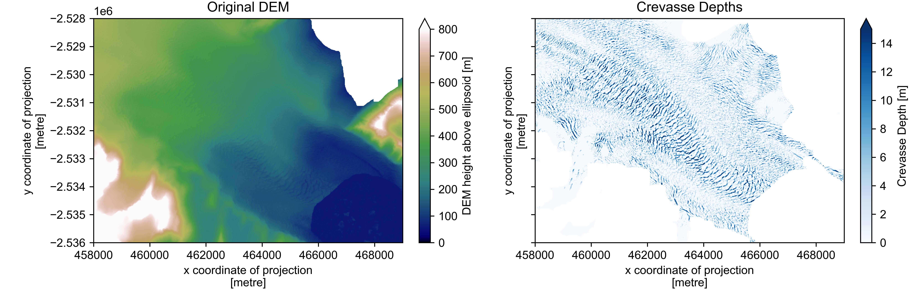

# CrevDEM

**_Tools for extracting crevasse location and volume from high-resolution digital elevation models._**


CrevDEM is a Python package for extracting crevasse location and volume from high-resolution Digital Elevation Models (DEMs) of glaciers and ice sheets.

The functions within provide a complete workflow for:

1. Automatically downloading and clipping 2 m strips of the version 4.1 ArcticDEM (Porter _et al._ 2022) and Reference Elevation Model of Antarctica (REMA; Howat _et al._ 2022).
2. DEM geoid correction and filtering of bare rock and proglacial sea-ice/mélange.
3. Extracting crevasse presence following the method outlined by Chudley _et al._ (_in prep_).

The principle of crevasse extraction is based around Black Top Hat filtering of a detrended surface (Kodde _et al._ 2007). The optimal kernel size can be determined quantiatively through the use of variogram analysis: a notebook is provided to aid with this. 

> **Warning** 
> This workflow is designed for scientific purposes only. ArcticDEM and REMA strips are not suitable for detecting sub-decametre-scale and snow-covered crevasses, and should not be used for field hazard assessment.



# Cite

Please cite the source paper when using CrevDEM:

> Chudley, T. R., Howat, I. M., King, M. D., and MacKie, E. (_in prep_) An increase in crevasses across accelerating Greenland Ice Sheet margins.

As always when using ArcticDEM and REMA products, please [cite](#refererences) the datasets appropriately and [acknowledge](#acknowledgements) the PGC.


# Installation

## Install CrevDEM

After downloading, `crevdem` can be installed from the top-level directory via `pip install .`:

```bash
git clone https://github.com/trchudley/crevdem
cd crevdem
pip install .
```

CrevDEM has the following dependencies:
  - rioxarray
  - Rasterio
  - Shapely
  - NumPy
  - OpenCV

The variogram analysis notebook requires additional packages, including `scikit-gstat`. If you would rather not install these yourself using `conda` or similar, you can use `pip install .[variogram]` during the initial install.

## Install supplementary datasets

Supplementary datasets are required to be available locally to complete geoid correction and filtering of non-glacial regions: specifically, the BedMachine Greenland v5 or BedMachine Antarctica v3 respectively (Morlighem _et al._ 2022a, 2022b) and, for Greenland, the GrIMP ice mask (Howat, 2017) for bedrock filtering. File or directory paths will be requested in the relevant functions.

These can be downloaded from the NSIDC manually ([Greenland BedMachine](https://doi.org/10.5067/GMEVBWFLWA7X), [Antarctic BedMachine](https://doi.org/10.5067/FPSU0V1MWUB6), [Greenland surface mask](https://doi.org/10.5067/B8X58MQBFUPA)) but for conveninence, download scripts are provided in the `supp_data` directory. The BedMachine download scripts are provided by the NSIDC, and require an Earthdata user account and password to be provided. The files will be downloaded into the directory the scripts are run. 

```bash
cd supp_data
python download_bedmachine_greenland_v5.py
python download_grimp_2015_15m.py
python download_bedmachine_antarctica_v3.py
```


# Usage

The sections below briefly outline the purpose of user-exposed functions available through the package. In order to see them in action, Jupyter Notebooks are provided in the `./notebooks` directory in order to provide an introduction into the use of CrevDEM. 

Information on the required and optional input variable for individual functions can be accessed through Python's `help()` function, e.g. `help(crevdem.load_aws)`.

### Loading

`load_aws()` - Returns the selected ArcticDEM/REMA strip, downloaded from the relevant AWS bucket, as an xarray DataArray suitable for further processing by `crevdem`. Option to filter to bounds and bitmask. 2 m DEM strips are large in size and loading remotely from AWS may take some time.

`load_local()` - Loads the desired ArcticDEM/REMA DEM strip, from local filepaths, as an xarray DataArray suitable for further processing by `crevdem`. Option to filter to bounds and bitmask.

### Filtering

`mask_bedrock()` - Returns a bedrock-masked DEM. Can either provide your own mask (as a DataArray) using the `mask` variable (where bedrock = 0/False and ice/ocean = 1/True), or provide the path to a directory containing the [GrIMP 15 m classification mask](https://doi.org/10.5067/B8X58MQBFUPA) using the `grimp_mask_dir` variable.

`geoid_correct()` - Returns a geoid-corrected DEM. Can provide either your own geoid (as a DataArray) using the `geoid` variable, or the filepath to an appropriate BedMachine dataset using the `bedmachine_fpath` variable.

`mask_melange()` - Returns a DEM with mélange/ocean region, as identified by `get_melange_mask()` function, filtered out. If no likely sea level is identified, returns the original DEM. DEM must be geoid-corrected.

`get_melange_mask()` - Returns a mask of mélange/ocean regions of a DEM, using sea level as returned by the `get_sea_level()` function. Input DEM must be geoid-corrected. In returned mask, land/ice is True and ocean is False.

`get_sea_level()` - Returns estimated sea level following method of Shiggins _et al._ (2023). If no candidate sea level is identified, `None` is returned. Input DEM must be geoid-corrected.

### Extracting crevasse presence

`find()` - Returns crevasse depths, batch processed from input DEM strip. Parameters default to Chudley _et al._ generic workflow for Greenland marine margins, but can be modified. This function is a wrapper for the `detrend`, `bth_filter`, `threshold_depth`, `interpolate_surface`, and `calc_depth` functions.

 - `detrend()` - Returns a detrended DEM DataArray using a large gaussian filter. Standard deviation size should be >> the features of interest (in the default `crevdem` settings, the gauss_std to be 3* the range).

 - `bth()` - Returns a black-top-hat-filtered DEM DataArray from the (detrended) DEM DataArray. Kernel diameter is set following the range distance.

 - `threshold_depth()` - Returns crevasse mask (crevasse = 1; not crevasse = 0) DataArray from BTH-filtered DataArray. Mask is filtered to the threshold BTH value, which is set to 1 metre in the default workflow.

 - `interpolate_surface()` - Returns a 'crevasse-filled' DEM from the original DEM and crevasse mask, using the GDAL FillNodata algorithm (inverse distance weighting) to fill crevasse-masked regions. Smoothing iterations are applied to smooth  out artefacts.

 - `calc_depth()` - Returns final crevasse depth, calculated from the raw DEM and the filled DEM.

# Improvements

 - [ ] Print timing during verbose output
 - [ ] BedMachine mask option for Antarctica

The tool is presented _as-is_, but requests/contributions to functionality are welcome (thomas.r.chudley@durham.ac.uk). Avenues for future work include the following:

 - An additional filter for remnant cloud blunders, as implemented in the latest ArcticDEM and REMA mosaic tools.
 - Exploring alternative/custom Gaussian filters to prevent erosion at edges. Currently, Guassian and BTH filters return `Nan` if `NaN`s are present within the kernel, leading to lack of analysis at glacier margins. It might be possible to rewrite these functions to account for `NaN` values (`astropy` already has such a function for Gaussian filters but is _very_ slow)


# References

Chudley, T. R., _et al._ (_in prep_). An increase in crevasses across accelerating Greenland Ice Sheet margins. 

Howat, I. (2017). MEaSUREs Greenland Ice Mapping Project (GIMP) Land Ice and Ocean Classification Mask, Version 1 [Data Set]. _NASA National Snow and Ice Data Center Distributed Active Archive Center_. https://doi.org/10.5067/B8X58MQBFUPA

Howat, I., _et al._ (2022). The Reference Elevation Model of Antarctica – Strips, Version 4.1. _Harvard Dataverse_ https://doi.org/10.7910/DVN/X7NDNY

Kodde, M. P., _et al._ (2007). Automatic glacier surface analysis from airborne laser scanning. _The International Archives of the Photogrammetry, Remote Sensing and Spatial Information Sciences_, 36(3), 221–226.

Morlighem, M. _et al._ (2022). MEaSUREs BedMachine Antarctica, Version 3 [Data Set]. _NASA National Snow and Ice Data Center Distributed Active Archive Center_. https://doi.org/10.5067/FPSU0V1MWUB6

Morlighem, M. _et al._ (2022). IceBridge BedMachine Greenland, Version 5 [Data Set]. _NASA National Snow and Ice Data Center Distributed Active Archive Center_. https://doi.org/10.5067/GMEVBWFLWA7X

Porter, C., _et al._ (2022). ArcticDEM - Strips, Version 4.1. _Harvard Dataverse_. https://doi.org/10.7910/DVN/OHHUKH

Shiggins, _et al._ (2023). Automated ArcticDEM iceberg detection tool: insights into area and volume distributions, and their potential application to satellite imagery and modelling of glacier–iceberg–ocean systems, The Cryosphere, 17, 15–32, https://doi.org/10.5194/tc-17-15-2023

# Acknowledgements

**ArcticDEM:** DEMs are provided by the Polar Geospatial Center under NSF-OPP awards 1043681, 1559691, and 1542736.

**REMA:** DEMs are provided by the Byrd Polar and Climate Research Center and the Polar Geospatial Center under NSF-OPP awards 1543501, 1810976, 1542736, 1559691, 1043681, 1541332, 0753663, 1548562, 1238993 and NASA award NNX10AN61G. Computer time provided through a Blue Waters Innovation Initiative. DEMs produced using data from Maxar.